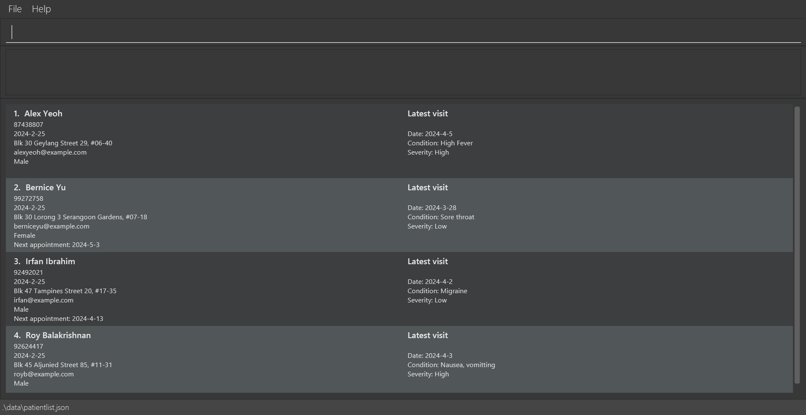
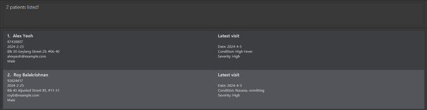

# MediTrack User Guide

## Introduction

Welcome to the MediTrack User Guide, your comprehensive companion in navigating the MediTrack application. This guide is designed to empower users-healthcare professionals and receptionists-by providing in-depth knowledge and practical tips on utilizing MediTrack effectively for patient data management. The user guide is written in a way that is easy to comprehend to even those with no prior technical knowledge or experience with a similar task management application.

MediTrack stands at the forefront of healthcare technology, offering an intuitive platform for recording and managing patient data. Our application is built with the dual purpose of enhancing patient care and streamlining administrative tasks, thereby facilitating a more efficient and productive healthcare environment. Using a Command Line Interface (CLI) while still having the benefits of a Graphical User Interface (GUI), MediTrack will allow for greater efficiency in typing commands to carry out all necessary functions in managing patient particulars.

The purpose of this User Guide is multifaceted. Primarily, it serves as an educational tool, introducing you to the myriad features and functionalities of MediTrack. Whether you are a first-time user or looking to deepen your understanding of more advanced features, this guide is tailored to meet your needs. It provides step-by-step instructions, best practices, and troubleshooting advice to ensure that you can navigate the application with ease and confidence.

<!-- * Table of Contents -->
<page-nav-print />

--------------------------------------------------------------------------------------------------------------------

## Quick start

1. Ensure you have Java `11` or above installed in your Computer.

1. Download the latest `MediTrack.jar` from [here](https://github.com/AY2324S2-CS2103T-T14-2/tp/releases).

1. Copy the file to the folder you want to use as the _home folder_ for MediTrack.

1. Open a command terminal, `cd` into the folder you put the jar file in, and use the `java -jar MediTrack.jar` command to run the application.  
   A GUI similar to the below should appear in a few seconds. Note how the app contains some sample data. 
   

1. Type the command in the command box and press Enter to execute it. e.g. typing **`help`** and pressing Enter will open the help window. 
   Some example commands you can try:

   * `list` : Lists all patients.

   * `add n/John Doe p/98765432 e/johnd@example.com a/311, Clementi Ave 2, #02-25 b/25/2/2024 s/Male` : Adds a patient named `John Doe` to the patient list.

   * `delete 3` : Deletes the 3rd patient shown in the current list.

   * `exit` : Exits the app.

1. Refer to the [Features](#features) below for details of each command.

--------------------------------------------------------------------------------------------------------------------

## Features

<box type="info" seamless>

**Notes about the command format:** 

* Words in `UPPER_CASE` are the parameters to be supplied by the user. 
  e.g. in `add n/NAME`, `NAME` is a parameter which can be used as `add n/John Doe`.

* Items in square brackets are optional.  
  e.g. `n/NAME [o/APPOINTMENT]` can be used as `n/John Doe o/2024-4-1` or as `n/John Doe`.

* Parameters can be in any order. 
  e.g. if the command specifies `n/NAME p/PHONE_NUMBER`, `p/PHONE_NUMBER n/NAME` is also acceptable.

* Extraneous parameters for commands that do not take in parameters (such as `help`, `list` and `exit`) will be ignored. 
  e.g. if the command specifies `help 123`, it will be interpreted as `help`.

* For any parameters using date format, strictly need to follow "yyyy-MM-dd" and "dd/MM/yyyy".

* Duplicate patients are not allowed (Patients are considered the same patients if they have the same name and phone number).

* Name should only consist of letters, or a single special character surrounded by letters, the special characters allowed being spaces, `\`,  `/` and `-`. For example, `s/o` is allowed, but `s / o` is not since `/` is between 2 spaces.

* Phone can have from 3 to 8 digits.

* There is no restriction in Date of Birth and Appointment. Appointment can be before Date of Birth.

* Sex field only accepts specific "Male" and "Female" as an input (eg. "MALE" or "FEMALE" is not accepted).

* Severity field only accepts specific label as "Low" or "High" as an input (eg. "LOW" or "HIGH" is not accepted).

* If you are using a PDF version of this document, be careful when copying and pasting commands that span multiple lines as space characters surrounding line-breaks may be omitted when copied over to the application.
</box>

--------------------------------------------------------------------------------------------------------------------

## Command summary

| Action                                             | Format, Example                                                                                                                                                                                                                                                                   |
|----------------------------------------------------|-----------------------------------------------------------------------------------------------------------------------------------------------------------------------------------------------------------------------------------------------------------------------------------|
| **Add Patient**                                    | `add n/NAME p/PHONE_NUMBER e/EMAIL a/ADDRESS b/DATE_OF_BIRTH s/SEX`   e.g., `add n/John Doe p/98765432 e/johnd@example.com a/311, Clementi Ave 2, #02-25 b/25/2/2024 s/Male`                                                                                                   |
| **Add Visit**                                      | `addv INDEX d/DATE_OF_VISIT c/CONDITION v/SEVERITY` or   `addv n/NAME p/PHONE_NUMBER d/DATE_OF_VISIT c/CONDITION v/SEVERITY`   e.g., `addv 1 d/25/2/2024 c/Mild Fever v/Low`                                                                                                |
| **Delete by index**                                | `delete INDEX`  e.g., `delete 3`                                                                                                                                                                                                                                               |
| **Delete by name and phone**                       | `delete-p n/NAME p/PHONE_NUMBER`  e.g. `delete-p n/Jaeho p/22224444`                                                                                                                                                                                                           |
| **Delete all**                                     | `delete-all`                                                                                                                                                                                                                                                                      |
| **Force delete all**                               | `delete-all-f`                                                                                                                                                                                                                                                                    |
| **Delete Visit**                                   | `deletev INDEX` or   `deletev n/NAME p/PHONE_NUMBER`  e.g., `deletev 3`                                                                                                                                                                                                     |
| **Edit Patient**                                   | `edit INDEX [n/NAME] [p/PHONE_NUMBER] [e/EMAIL] [a/ADDRESS] [b/DATE_OF_BIRTH] [s/SEX] [o/APPOINTMENT]` or   `edit n/NAME p/PHONE_NUMBER [n/NAME] [p/PHONE] [e/EMAIL] [a/ADDRESS] [b/DATEOFBIRTH] [s/SEX] [o/APPOINTMENT]`  e.g.,`edit 2 n/James Lee e/jameslee@example.com` |
| **Edit Visit**                                     | `editv INDEX [d/DATE_OF_VISIT] [c/CONDITION] [v/SEVERITY`] or   `editv n/NAME p/PHONE_NUMBER [d/DATE_OF_VISIT] [c/CONDITION] [v/SEVERITY]`  e.g.,`editv n/Alex Yeoh p/87438807 c/Sore throat v/Low`                                                                         |
| **Find**                                           | `find [n/KEYWORDS] [p/PHONE_NUMBER]`  e.g., `find n/John p/98765432`                                                                                                                                                                                                           |
| **List**                                           | `list`                                                                                                                                                                                                                                                                            |
| **List in alphabetical order**                     | `list-a`                                                                                                                                                                                                                                                                          |
| **List in order of appointment date**              | `list-by-date`                                                                                                                                                                                                                                                                    |
| **List all appointments on/before a certain date** | `list-until-date o/dd/mm/yyyy` e.g. , `list-until-date o/12/01/2024`                                                                                                                                                                                                              |
| **Help**                                           | `help`                                                                                                                                                                                                                                                                            |
| **Exit**                                           | `exit`                                                                                                                                                                                                                                                                            |
| **Force exit**                                     | `exit-f`                                                                                                                                                                                                                                                                          |

--------------------------------------------------------------------------------------------------------------------

### Viewing help, accessing user guide : `help`

Shows a message that provides the link to the user guide.

Format: `help`

### Adding a patient: `add`

Adds a patient to the patient list.

Format: `add n/NAME p/PHONE_NUMBER e/EMAIL a/ADDRESS b/DATE_OF_BIRTH s/Sex`

<box type="info" seamless>

**Note:** Appointment field can only be edited after adding the patient into the patient list
</box>

Example:
* `add n/John Doe p/98765432 e/johnd@example.com a/John street, block 123, #01-01 b/2001-1-1 s/Male`

### Adding a visit to a patient: `addv`

Adds a visit to a patient.

Format: `addv INDEX d/DATE_OF_VISIT c/CONDITION v/SEVERITY` or `addv n/NAME p/PHONE_NUMBER d/DATE_OF_VISIT c/CONDITION v/SEVERITY`

* Adds a new visit to the patient at the specified `INDEX`. The index refers to the index number shown in the displayed patient list. The index **must be a positive integer** 1, 2, 3, …​
* Alternatively provide the desired patient's name and phone number instead of the index.
* If both an index and one of name or phone number is provided, the index will be prioritised and latter will be ignored.
* The new visit will be the one shown in the UI.
* The specified patient will move to the bottom of the patient list.

Example:
* `addv 1 d/25/2/2024 c/Mild Fever v/Low`
* `addv n/Alex Yeoh p/87438807 d/25/2/2024 c/High Fever v/High`

### Listing all patients : `list`

Shows a list of all patients in the patient list.

Format: `list`

### Listing all patients in alphabetical order : `list-a`

Shows a list of all patients in the patient list in alphabetical order.

Format: `list-a`

**Note:** Currently, list-a can only support names where the first letters are in uppercase. Names that are in lowercase will not be listed in the correct order.

### Listing all patients in order of appointment date : `list-by-date`

Shows a list of all patients in the patient list in order of appointment.

Format: `list-by-date`

### Listing all patients whose appointments fall or on before a certain date : `list-until-date`

Shows a list of all patients in the patient list whose appointments fall on or before the given date.

Format: `list-until-date o/dd/mm/yyyy`

Example:
* `list-until-date o/13/01/2024` Displays all patients with appointments on or before 13 January 2024.

### Editing a patient : `edit`

Edits an existing patient in the patient list.

Format: `edit INDEX [n/NAME] [p/PHONE] [e/EMAIL] [a/ADDRESS] [b/DATEOFBIRTH] [s/SEX] [o/APPOINTMENT]` or `edit n/NAME p/PHONE_NUMBER [n/NAME] [p/PHONE] [e/EMAIL] [a/ADDRESS] [b/DATEOFBIRTH] [s/SEX] [o/APPOINTMENT]`

* Edits the patient at the specified `INDEX`. The index refers to the index number shown in the displayed patient list. The index **must be a positive integer** 1, 2, 3, …​
* At least one of the optional fields must be provided.
* Existing values will be updated to the input values.

Example:
*  `edit 1 p/91234567 e/johndoe@example.com` Edits the phone number and email address of the 1st patient to be `91234567` and `johndoe@example.com` respectively.
*  `edit 2 n/Betsy Crower` Edits the name of the 2nd patient to be `Betsy Crower`.
*  `edit n/Alex Yeoh p/88472848 n/Eugene` Edits the name of patient from `Alex Yeoh` to `Eugene`. 

### Editing the latest visit of a patient: `editv`

Edits the displayed visit of a patient.

Format: `editv INDEX [d/DATE_OF_VISIT] [c/CONDITION] [v/SEVERITY]` or `editv n/NAME p/PHONE_NUMBER [d/DATE_OF_VISIT] [c/CONDITION] [v/SEVERITY]`

* Edits the latest visit of the patient at the specified `INDEX`. The index refers to the index number shown in the displayed patient list. The index **must be a positive integer** 1, 2, 3, …​
* At least one of the optional fields must be provided.
* Alternatively provide the desired patient's name and phone number instead of the index.
* If both an index and one of name or phone number is provided, the index will be prioritised and latter will be ignored.
* The edited visit will be the one shown in the UI.
* The specified patient will move to the bottom of the patient list.

Example:
* `editv 1 d/25/2/2024` Edits the visit date of the 1st patient to `25/2/2024`
* `editv n/Alex Yeoh p/87438807 c/Sore throat v/Low` Edits the condition and severity of `Alex Yeoh` with `87438807` to `Sore throat` and `Low`.

### Locating patients by name: `find`

Finds patients whose name contains the given keyword and/or whose phone number matches the given one.

Format: `find [n/KEYWORDS] [p/PHONE_NUMBER]`

* At least one of the optional fields must be provided.
* If both fields are provided, patient must meet both conditions to be listed.
* The search for name is case-insensitive. e.g. `hans` will match `Hans`.
* The order of the keywords does not matter. e.g. `Hans Bo` will match `Bo Hans`.
* Keywords must be separated by a space to be recognised as distinct.
* Only full words will be matched. e.g. `Han` will not match `Hans`.
* Patients matching at least one keyword will be returned (i.e. `OR` search).
  e.g. `Hans Bo` will return `Hans Gruber`, `Bo Yang`.
* Unlike keywords, only 1 phone number can be provided. e.g. `p/98765432 97538642` is invalid.

Example:
* `find n/John` returns `john` and `John Doe`.
* `find n/John p/98765432` returns a patient with name `john` and phone number `98765432`.
* `find n/alex roy` returns `Alex Yeoh`, `Roy Balakrishnan`. The output is shown below.  
  

### Deleting a patient using index number within the patient list : `delete`

Deletes the patient at the specified index within the patient list.

Format: `delete INDEX`

* Deletes the patient at the specified `INDEX`.
* The index refers to the index number shown in the displayed patient list.
* The index **must be a positive integer** 1, 2, 3, …​

Example:
* `delete 1` returns “Successfully deleted patient NAME’s data” for the patient at index 1.

### Deleting a specific patient using name and phone number : `delete-p`

Deletes the patient with the specified name and phone number within the patient list.

Format: `delete-p n/NAME p/PHONE_NUMBER`

* Refer to the respective rules under the 'add' command for acceptable inputs to 'delete-p' command.

Example: 
* `delete n/Eugene Hirose p/90807561` returns “Successfully deleted patient Eugene Hirose’s data”.

### Deleting all entries : `delete-all`

Lets the system know the user wants to delete all entries from the patient list.

Format: `delete-all`

Example:
* 'delete-all' followed by 'yes' removes all entries and show an empty list of patients.
* 'delete-all' followed by 'no' does not cause any changes to the patient list.

### Forcefully deleting all entries : `delete-all-f`

Forcefully deletes all entries from the patient list.

Format: `delete-all-f`

Example:
* `delete-all-f` removes all entries and show an empty list of patients.

### Deleting the latest visit of a patient: `deletev`

Deletes the displayed visit of a patient.

Format: `deletev INDEX` or `deletev n/NAME p/PHONE_NUMBER`

* Deletes the latest visit of the patient at the specified `INDEX`. The index refers to the index number shown in the displayed patient list. The index **must be a positive integer** 1, 2, 3, …​
* Alternatively provide the desired patient's name and phone number instead of the index.
* If both an index and one of name or phone number is provided, the index will be prioritised and latter will be ignored.
* The new visit displayed will be the one added before the deleted visit, if there is one.
* The specified patient will move to the bottom of the patient list.

Example:
* `deletev 1`
* `deletev n/Alex Yeoh p/87438807`

### Exiting the program : `exit`

Lets the system know the user wants to exit the program.

Format: `exit`

Example:
* 'exit' followed by 'yes' exits the application.
* 'exit' followed by 'no' causes no changes to the application and cancel exit command.

### Forcefully exiting the program : `exit-f`

Forcefully exits the program.

Format: `exit-f`

Example:
* 'exit-f' exits the application.

### Editing the data file

MediTrack data are saved automatically as a JSON file `[JAR file location]/data/patientlist.json`. Advanced users are welcome to update data directly by editing that data file.

<box type="warning" seamless>

**Caution:**
If your changes to the data file makes its format invalid, MediTrack will discard all data and start with an empty data file at the next run.  Hence, it is recommended to take a backup of the file before editing it. 
Furthermore, certain edits can cause the MediTrack to behave in unexpected ways (e.g., if a value entered is outside the acceptable range). Therefore, edit the data file only if you are confident that you can update it correctly.
</box>

## FAQ

**Q**: How do I transfer my data to another Computer? 
**A**: Install the app in the other computer and overwrite the empty data file it creates with the file that contains the data of your previous MediTrack home folder.

**Q**: How can I check where my data file is located? 
**A**: Check your `[JAR file location]/preferences.json`. The location of your data file is listed under `patientListFilePath`. You can also change this if needed.

**Q**: How do I change the default size of the window? 
**A**: In your `[JAR file location]/preferences.json`, you can adjust the initial window dimensions and location. 

**Q**: I've used the `find` command to look for a specific patient. How do I go back to the full list? 
**A**: You may use the `list` command or one of its variations.

--------------------------------------------------------------------------------------------------------------------

## Known issues

1. **When using multiple screens**, if you move the application to a secondary screen, and later switch to using only the primary screen, the GUI will open off-screen. The remedy is to delete the `preferences.json` file created by the application before running the application again.
2. Command prompts in the error messages do not follow the command format given in the [Features](#features) section, specifically regarding the use of square brackets. It is recommended to refer back to this user guide if you encounter any issues with commands.

--------------------------------------------------------------------------------------------------------------------

